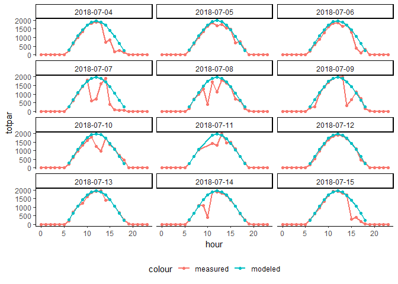
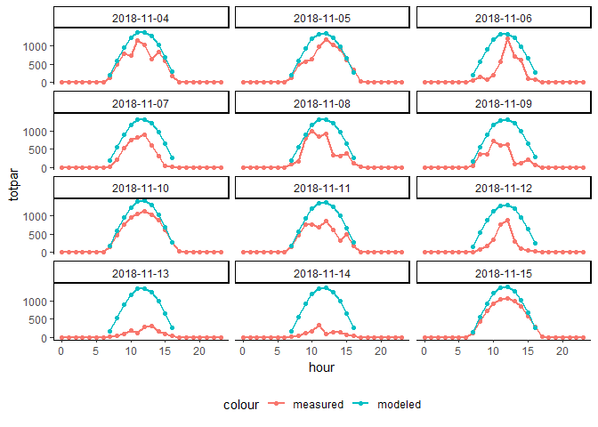

```r
library(SWMPr)
library(tidyverse)
library(lubridate)
dat <- SWMPr::import_local("../Main Docs/Data-latest", "gndcrmet2018")
```

# Function to calculate modeled PAR  

This is based on the model used on clearskycalculator.com:

website: http://clearskycalculator.com/quantumsensor.htm

ASCE report with derivation of model:
https://www.apogeeinstruments.com/content/EWRI-ASCE-Reference-ET.pdf

Appendices (Appendix D has equations needed here):
https://www.apogeeinstruments.com/content/EWRI-ASCE-Reference-ET-Appendices.pdf


```r
calc_modeled_PAR <- function(doy, time_hrs,
                             rh, temp, bp_mb,
                             lat_decdeg, long_decdeg, longTZ){
    
    # doy and time_hrs need to be pre-calculated
    # maybe later I can get this to use POSIXct to automate it, but not now
    
    # unit conversions
    bp_kPa <- bp_mb / 10
    lat_rad <- lat_decdeg * pi / 180

    # intermediate calculations
    # easy ones
    eT <- 0.6108 * exp( (17.27*temp) / (temp + 237.3) )
    ea <- (rh / 100) * eT
    prcp_water <- (0.14 * ea * bp_kPa) + 2.1
    
    # intermediate: Ra
    solar_decl <- 0.409 * sin( ((2*pi*doy)/365) - 1.39 )  # solar angle
    dr <- 1 + 0.033 * cos(2*pi*doy / 365)
    Gsc <- 1361  # solar constant, W/m^2
    ws <- acos( -tan(lat_rad) * tan(solar_decl) )   # sunset hour angle, radians
    b <- 2*pi*(doy-81)/364
    Sc <- 0.1645*sin(2*b) - 0.1255*cos(b) - 0.025*sin(b)
    w <- pi/12 * ( (time_hrs + 0.06667*(longTZ - long_decdeg) + Sc) - 12 )  # eq 54
    w1 <- w - (pi/24)  # this was pi * calc_period/24, but it works best on an hourly scale
    w2 <- w + (pi/24)
    if(w1 < -ws){w1 <- -ws}
    if(w2 < -ws){w2 <- -ws}
    if(w1 > ws){w1 <- ws}
    if(w2 > ws){w2 <- ws}
    if(w1 > w2){w1 <- w2}
    Ra <- 12/pi * Gsc * dr * ( ((w2-w1)*sin(lat_rad)*sin(solar_decl)) + (cos(lat_rad)*cos(solar_decl)*(sin(w2)-sin(w1)) ) )
    
    # Ra to Rso
    sin_sun <- sin(lat_rad)*sin(solar_decl) + cos(lat_rad)*cos(solar_decl)*cos(w)
    aa <- -0.00146*bp_kPa/sin_sun
    bb <- 0.075*(prcp_water/sin_sun)^0.4
    KB <- 0.98 * exp( aa - bb )
    KD <- 0.35 - 0.36*KB
    Rso <- (KB + KD) * Ra
    
    # unit conversion: Rso above is W/m^2 total solar radiation
    # we need micromoles/m^2/sec; one conversion is 4.57
    # the other is, only 45% of solar radiation is PAR
    
    Rso * 4.57 * 0.45
}
```

# Use it on SWMP data  

### Run qaqc step on data (read in above)  


```r
dat2 <- qaqc(dat, qaqc_keep = c(0, 1, 4, 5))
```


### Generate columns for day of year and hour  

Also do other assorted cleanup  


```r
dat3 <- dat2 %>% 
        separate(datetimestamp, into = c("date", "time"), sep = "\\s") %>%
        separate(time, into = c("hour", "minute", "seconds"), sep = "\\:") %>% 
        filter(minute == "00") %>% 
        mutate(doy = lubridate::yday(date),
               hour = as.numeric(hour),
               comppar = totpar * 1.11) %>% 
        select(date, doy, hour, atemp, rh, bp, wspd, totpar, comppar)
```


### Run the model  

This uses `pmap()` from the `purrr` package to apply the function we made above to the rows of my modified data frame. I've hard-coded a few of the parameters specific to Grand Bay's MET station, and these need to be changed for other people to use the code. Latitude, longitude (positive degrees for west, which is opposite what most people are used to), and the center of the time zone (75, 90, 105, 120 for eastern, central, mountain, and pacific, respectively; others can be found here: http://clearskycalculator.com/longitudeTZ.htm )


```r
par_out <- dat3 %>% 
        mutate(modpar = pmap(list(doy = doy,
                 time_hrs = hour,
                 rh = rh,
                 temp = atemp,
                 bp_mb = bp,
                 lat_decdeg = 30.35918,
                 long_decdeg = 88.419,
                 longTZ = 90), 
                 calc_modeled_PAR)) %>% 
        unnest()
```


### Make a graph  

Filter the dataset to a small subset of dates because this plot will have a panel for each day.  


```r
par_out %>% 
        mutate(date = as.Date(date)) %>% 
        filter(between(date, lubridate::ymd("2018-07-04"), lubridate::ymd("2018-07-15"))) %>% 
        ggplot() +
        geom_point(aes(x = hour, y = totpar, col = "measured")) +
        geom_line(aes(x = hour, y = totpar, col = "measured"), size = 1) +
        geom_point(aes(x = hour, y = modpar, col = "modeled")) +
        geom_line(aes(x = hour, y = modpar, col = "modeled"), size = 1) +
        facet_wrap(~ date, ncol = 3) +
        theme_classic() +
        theme(legend.position = "bottom")
```

<!-- -->


#### Some different dates, after the PAR sensor got squirrely  


```r
par_out %>% 
        mutate(date = as.Date(date)) %>% 
        filter(between(date, lubridate::ymd("2018-11-04"), lubridate::ymd("2018-11-15"))) %>% 
        ggplot() +
        geom_point(aes(x = hour, y = totpar, col = "measured")) +
        geom_line(aes(x = hour, y = totpar, col = "measured"), size = 1) +
        geom_point(aes(x = hour, y = modpar, col = "modeled")) +
        geom_line(aes(x = hour, y = modpar, col = "modeled"), size = 1) +
        facet_wrap(~ date, ncol = 3) +
        theme_classic() +
        theme(legend.position = "bottom")
```

<!-- -->

