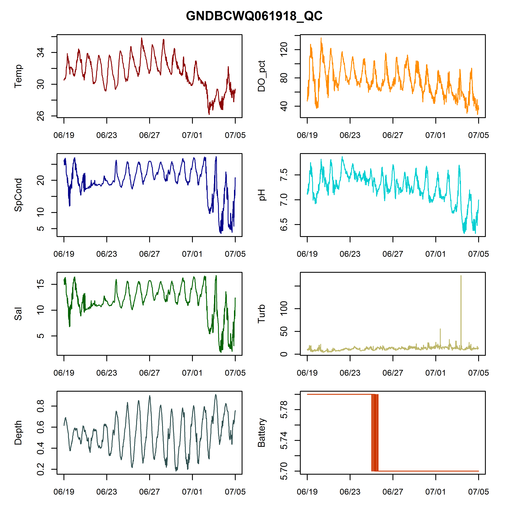
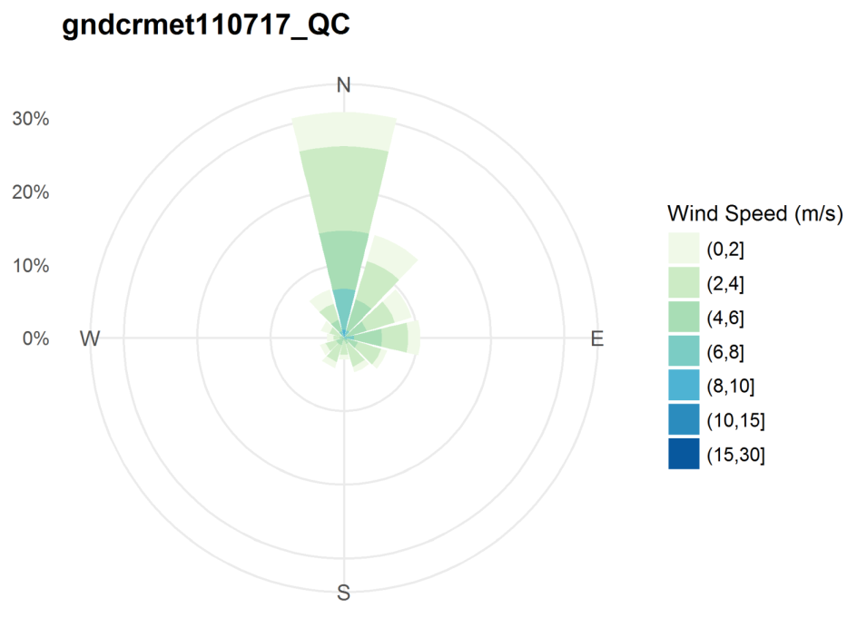

This is a collection of R scripts that can be used to QC SWMP data. Right click on the script name above to download. Each script has limited interactivity - in the course of running, you will be able to choose a working directory through Windows Explorer.   

Most of these work on QC files returned from the CDMO after data upload. There is one that will run on raw Excel files downloaded from YSI EXO2 instruments.  

# Script Descriptions  

## Water Quality Scripts  

### WQgraphs_rawEXO_looping: Loop through raw EXO Excel files in a folder  

`WQgraphs_rawEXO_looping`: runs through every Excel (.xls or .xlsx) file in the selected working directory; generates pdf output for each.  

+  Packages needed for this script and an installation command if you need it:  
    +  `dplyr`  - `install.packages('dplyr')`  
    +  `lubridate` - `install.packages('lubridate')`  
    +  `readxl` - `install.packages('readxl')`  
+  Make sure the only Excel files in your folder are files downloaded from EXOs.  
+  Parameters plotted are: Temp, SpCond, Sal, Depth, DO_pct, pH, Turb, and Battery.  
+  If you need to graph Level instead of Depth, change it on lines 107 and 152 of the script.  
+  The name of the output file (and the title above the graphs) is, by default, the full name of the Excel file, which includes instrument serial number and date-time on which the file started. To cut off all the extra stuff at the end, uncomment line 27. (You do not have to comment out line 24, but you can if you want to.)

### WQgraphs_QCfile_looping: Loop through CDMO-returned QC files in a folder  

`WQgraphs_QCfile_looping`: runs through every CSV in the selected working directory; generates pdf output for each.  

+  The only package used in this script is `tcltk`, which is installed along with base R.   
+  Make sure the only CSVs in your folder are water quality QC files emailed from the CDMO after file upload.  
+  Parameters plotted are: Temp, SpCond, Sal, Depth, DO_pct, pH, Turb, and Battery.  
+  If you need to graph Level instead of Depth, change it on line 102 of the script.

#### Example output  

## Weather Station Scripts  

### METgraphs_QCfile_single-file: One file  

`METgraphs_QCfile_single-file`: allows you to interactively select a single file from which to generate graphs. __This is usually the script I use for MET graphs, because we only download one file at once.__    

+  Packages needed for this script and an installation command if you need it:  
    +  `clifro`  - `install.packages('clifro')`  
    +  `ggplot2` - `install.packages('ggplot2')`  
+  A pdf file with two pages is generated:  
    +  The first page has line graphs of ATemp, RH, BP, TotPAR, WSpd, MaxWSpd, CumPrcp, and AvgVolt (which represents battery).  
    +  The second page has a wind rose, which shows direction in addition to speed.  

### METgraphs_QCfile_looping: Loop through files in a folder

`METgraphs_QCfile_looping`: Just like the above MET script, but it runs through every CSV in the selected working directory. As above, the `ggplot2` and `clifro` packages are required.  

#### Example output  

Don't be scared; these actually look pretty good in pdf format. I saved them as pngs to insert in this document, so they're a little wonky.  

__See some problems? This is why it's important to graph data.__    

(If you need a hint, look closely at Atemp - it doesn't get that cold in south Mississippi. There are also some apparent battery problems.)

  

__Wind Rose__  

This is pretty typical for winter at our site. Most wind is out of the North.

# Instructions for running scripts  

These instructions are also in comments at the top of each script. Scripts can be downloaded by right-clicking on the name of the file in the list above, and selecting "save link as". Another option is to click the green "Clone or Download" button to get them all.  

1.  Open the script.  
2.  Put the cursor somewhere in the script window, and hit 'Ctrl+a' to select all.  
3.  Either click the 'Run' button in the upper right corner of the script window, or use the 'Ctrl+Enter' keyboard shortcut to run the script.  
4.  Interactively choose your working directory (where multiple files are that you want to work through) or the single file you want (for the MET single-file script). __The file-choice pop-up does NOT show up on top of other programs; you MUST either click on the RStudio icon to minimize RStudio OR just minimize everything else to make the pop-up visible.__  
5.  Let the script do its thing.  
6.  Look in the working directory for your pdf files!  

# Some cautions  

These scripts have NOT been error-proofed.  

+  If you have some CSV in your working directory that does not match the format of CDMO-emailed QC files, the script will stop in its tracks and return an error message. Move the files you want to graph into their own folder and use that instead.  
+  If your sites report level instead of depth, you'll need to change the parameter on line 102 of the `WQgraphs_QCfile_looping` script.  

Let me know if you run into any other issues! You can open a GitHub issue here or just email me. And if you know how to make these scripts more robust to errors, feel free to make a pull request. (If you don't know what that means, just email me the scripts with your updates and I'll make them available here.)