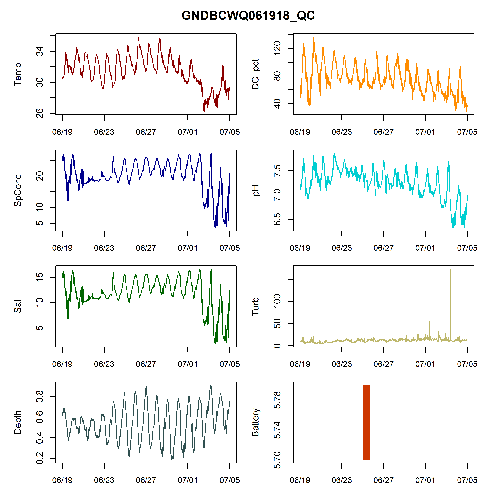
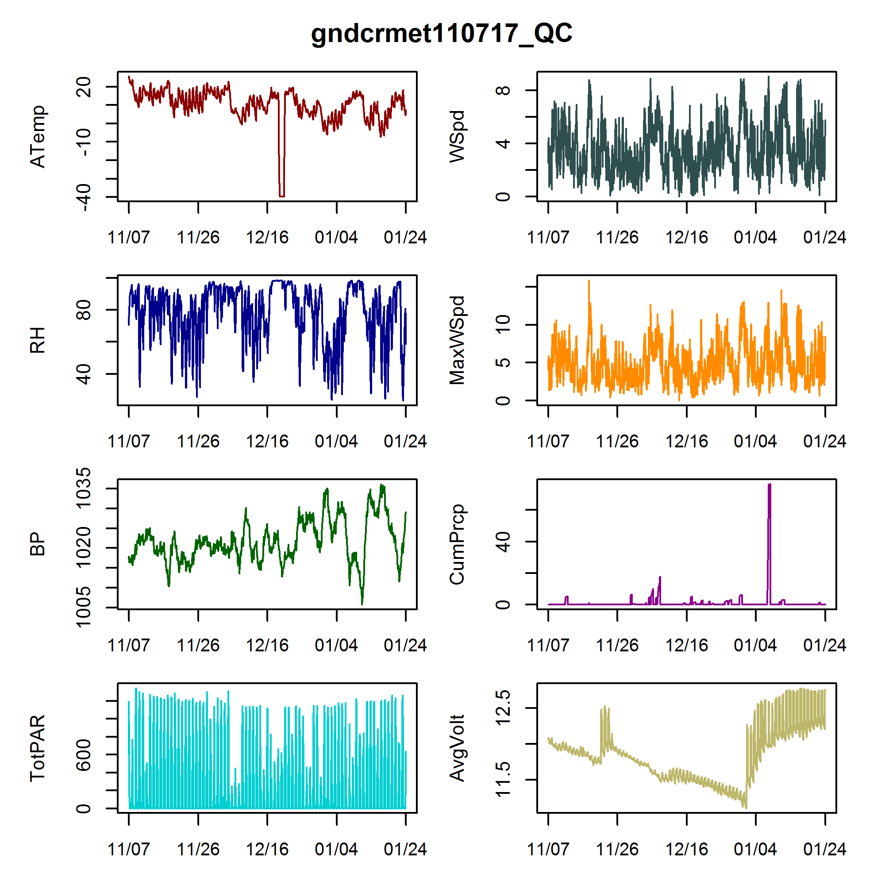
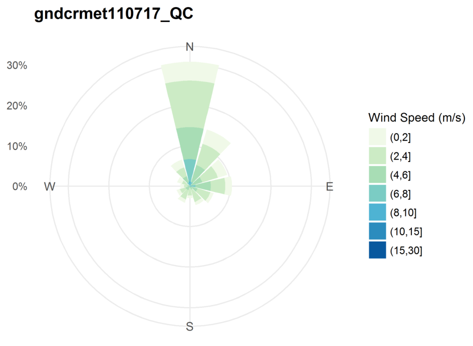

R Scripts for SWMP QC
================

-   [Script Descriptions](#script-descriptions)
    -   [Water Quality Scripts](#water-quality-scripts)
        -   [WQgraphs\_rawEXO\_looping: Loop through raw EXO Excel files in a folder](#wqgraphs_rawexo_looping-loop-through-raw-exo-excel-files-in-a-folder)
        -   [WQgraphs\_QCfile\_looping: Loop through CDMO-returned QC files in a folder](#wqgraphs_qcfile_looping-loop-through-cdmo-returned-qc-files-in-a-folder)
    -   [Weather Station Scripts](#weather-station-scripts)
        -   [METgraphs\_QCfile\_single-file: One file](#metgraphs_qcfile_single-file-one-file)
        -   [METgraphs\_QCfile\_looping: Loop through files in a folder](#metgraphs_qcfile_looping-loop-through-files-in-a-folder)
-   [Instructions for running scripts](#instructions-for-running-scripts)
-   [Some cautions](#some-cautions)
-   [Shout-outs](#shout-outs)

This is a collection of R scripts that can be used to QC SWMP data. Right click on the script name above (scroll up above the table of contents) and click 'save link as' to download. Each script has limited interactivity - in the course of running, you will be able to choose a working directory through Windows Explorer.

Most of these work on QC files returned from the CDMO after data upload. There is one that will run on raw Excel files downloaded from YSI EXO2 instruments.

These should work (and return the correct axis label) for either Depth or Level. Please let me know if you run into problems.

Script Descriptions
===================

Water Quality Scripts
---------------------

### WQgraphs\_rawEXO\_looping: Loop through raw EXO Excel files in a folder

`WQgraphs_rawEXO_looping`: runs through every Excel (.xls or .xlsx) file in the selected working directory; generates pdf output for each.

-   Packages needed for this script and an installation command if you need it:
    -   `dplyr` - `install.packages('dplyr')`
    -   `lubridate` - `install.packages('lubridate')`
    -   `readxl` - `install.packages('readxl')`
-   Make sure the only Excel files in your folder are files downloaded from EXOs.
-   Parameters plotted are: temp, spcond, sal, depth/level (script works with either), do\_pct, ph, turb, and battery\_v.
-   Script should work with either depth or level. Should also work for different units used when programming EXOs (e.g. salinity psu vs. salinity ppt).
-   The name of the output file (and the title above the graphs) is, by default, the full name of the Excel file, which includes instrument serial number and date-time on which the file started. To cut off all the extra stuff at the end, uncomment line 55. (You do not have to comment out line 52, but you can if you want to.)

### WQgraphs\_QCfile\_looping: Loop through CDMO-returned QC files in a folder

`WQgraphs_QCfile_looping`: runs through every CSV in the selected working directory; generates pdf output for each.

-   The only package used in this script is `tcltk`, which is installed along with base R.
-   Make sure the only CSVs in your folder are water quality QC files emailed from the CDMO after file upload.
-   Parameters plotted are: Temp, SpCond, Sal, Depth/Level (works with either), DO\_pct, pH, Turb, and Battery.

#### Example output

Weather Station Scripts
-----------------------

### METgraphs\_QCfile\_single-file: One file

`METgraphs_QCfile_single-file`: allows you to interactively select a single file from which to generate graphs. **This is usually the script I use for MET graphs, because we only download one file at once.**

-   Packages needed for this script and an installation command if you need it:
    -   `clifro` - `install.packages('clifro')`
    -   `ggplot2` - `install.packages('ggplot2')`
-   A pdf file with two pages is generated:
    -   The first page has line graphs of ATemp, RH, BP, TotPAR, WSpd, MaxWSpd, CumPrcp, and AvgVolt (which represents battery).
    -   The second page has a wind rose, which shows direction in addition to speed.

### METgraphs\_QCfile\_looping: Loop through files in a folder

`METgraphs_QCfile_looping`: Just like the above MET script, but it runs through every CSV in the selected working directory. As above, the `ggplot2` and `clifro` packages are required.

#### Example output

Don't be scared; these actually look pretty good in pdf format. I saved them as pngs to insert in this document, so they're a little wonky.

**See some problems? This is why it's important to graph data.**

(If you need a hint, look closely at Atemp - it doesn't get that cold in south Mississippi. There are also some apparent battery problems.)

**Wind Rose**

This is pretty typical for winter at our site. Most wind is out of the North.

Instructions for running scripts
================================

These instructions are also in comments at the top of each script. Scripts can be downloaded by right-clicking on the name of the file in the list above, and selecting "save link as". Another option is to click the green "Clone or Download" button to get them all.

1.  Open the script.
2.  Put the cursor somewhere in the script window, and hit 'Ctrl+a' to select all.
3.  Either click the 'Run' button in the upper right corner of the script window, or use the 'Ctrl+Enter' keyboard shortcut to run the script.
4.  Interactively choose the folder you want to work in (for the looping scripts) or the single file you want (for the MET single-file script).
    -   **The file-choice pop-up does NOT show up on top of other programs; you MUST either click on the RStudio icon to minimize RStudio OR just minimize everything else to make the pop-up visible.**
    -   These scripts will not change your working directory. (Versions created before 7/12/2018 did.)
5.  Let the script do its thing.
6.  Look in the directory with your data files and your pdf files will be there!

Some cautions
=============

These scripts have NOT been error-proofed.

-   If you have some CSV in your working directory that does not match the format of the script, it will stop in its tracks and return an error message. Move the files you want to graph into their own folder and use that instead.
    -   For `WQgraphs_rawEXO_looping`, they need to be Excel (.xls or .xlsx) files exported from EXOs using version 1 of KOR software. (They might work with version 2 but we don't use that - if you do and have issues, please let me know what they are.)
    -   For the other scripts: `WQgraphs_QCfile_looping`, `METgraphs_QCfile_looping`, and `METgraphs_QCfile_single-file`, the files need to be .csv files returned by the CDMO.

These were designed to just work and make your life easy even if you don't know R, so PLEASE let me know if something goes wrong! You can open a GitHub issue here or just email me. And if you know how to make these scripts more robust to errors, feel free to make a pull request. (If you don't know what that means, just email me the scripts with your updates and I'll make them available here.)

Shout-outs
==========

Thank you to John Haskins, Shannon Dunnigan, Ethan Bourque, Tracy Buck, and Elizabeth Moore for testing and improving these scripts!
